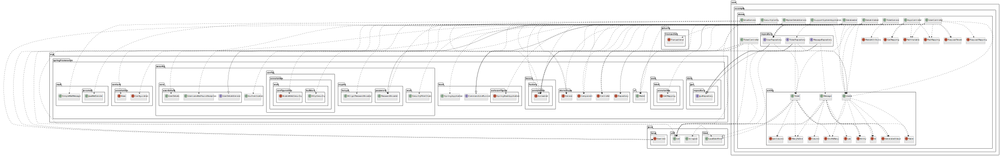
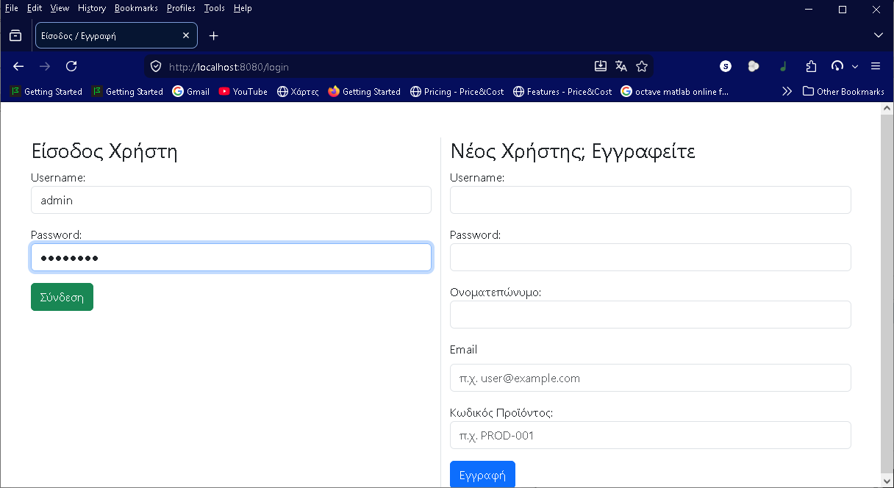
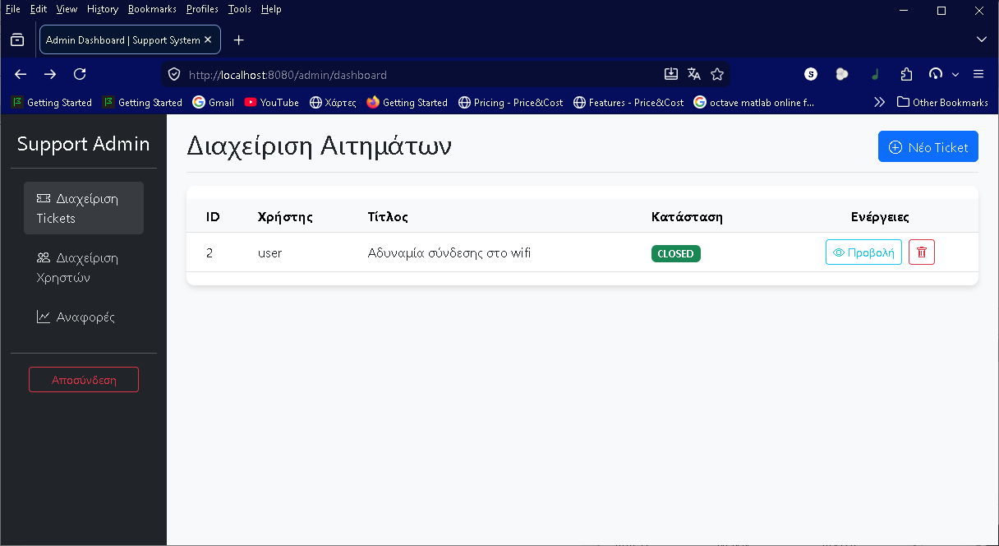
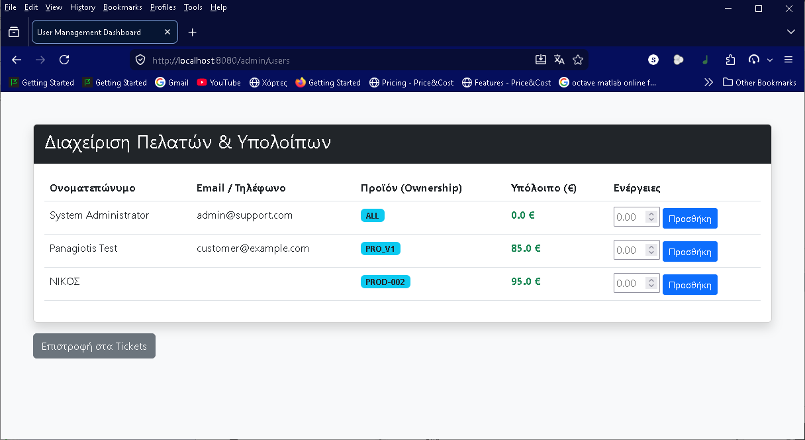
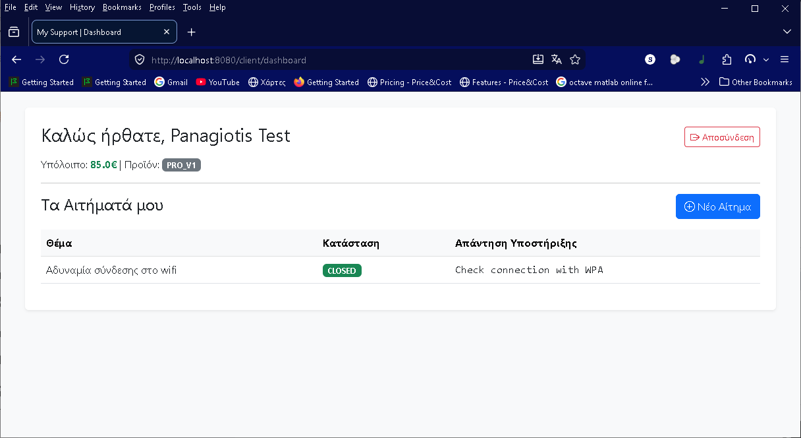

# Support Ticket System (Spring Boot) 🎫

Μια ολοκληρωμένη εφαρμογή διαχείρισης αιτημάτων υποστήριξης (Tickets) βασισμένη στο Spring Boot, σχεδιασμένη για την αυτοματοποίηση της επικοινωνίας μεταξύ πελατών και διαχειριστών.

## 🚀 Δυνατότητες

### Για τους Πελάτες (Clients):
* **Εγγραφή & Είσοδος:** Σύστημα ασφαλείας με Spring Security.
* **Δημιουργία Tickets:** Υποβολή αιτημάτων για συγκεκριμένα προϊόντα.
* **Chat System:** Ζωντανή επικοινωνία με τους διαχειριστές εντός του ticket.
* **Πορτοφόλι:** Αυτόματη χρέωση υπολοίπου κατά την επίλυση του προβλήματος.

### Για τους Διαχειριστές (Admins):
* **Dashboard:** Συνολική εικόνα των ανοιχτών αιτημάτων.
* **Διαχείριση Tickets:** Δυνατότητα απάντησης, χρέωσης και κλεισίματος αιτημάτων.
* **Reports:** Στατιστικά στοιχεία για τα συνολικά έσοδα και την κίνηση των προϊόντων.
* **Email Notifications:** Ειδοποιήσεις μέσω SMTP (Mailtrap) για την πορεία των αιτημάτων.

## 🛠 Τεχνολογίες
* **Backend:** Java 17, Spring Boot 3, Spring Data JPA
* **Security:** Spring Security (BCrypt hashing)
* **Database:** MySQL
* **Frontend:** Thymeleaf, Bootstrap 5
* **Email Testing:** Mailtrap (SMTP)

## ⚙️ Ρυθμίσεις
Για να τρέξετε την εφαρμογή, θα πρέπει να ρυθμίσετε το αρχείο `src/main/resources/application.properties` με τα δικά σας στοιχεία:
* MySQL Database credentials
* Mailtrap SMTP credentials

## 📊 Διάγραμμα κλάσεων

## 📸 Screenshots

